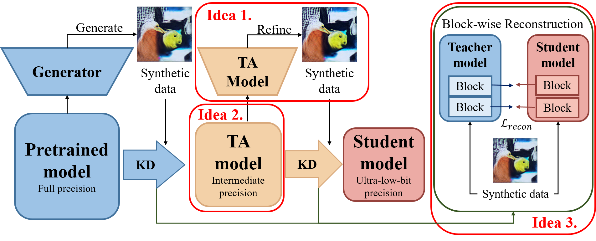

# ZEST: Accurate Zero-shot Quantization via Hierarchical Teacher-Assistant Distillation
A paper accepted to ECCV 2026, a top tier AI conference. The paper "Accurate Zero-shot Quantization via Hierarchical Teacher-Assistant Distillation" proposed an accurate zero-shot quantization framework using TA model for image classification models.


[](#) 

> **Accurate Zero-shot Quantization via Hierarchical Teacher-Assistant Distillation**

> Wonjin Cho, Jeongin Yun, and U Kang (Seoul National University)  
> *Accepted at [ECCV 2026]*

This is the official PyTorch implementation of **ZEST**, a hierarchical framework for zero-shot quantization that bridges the precision gap in ultra-low-bit networks using a Teacher Assistant (TA) stepping stone.

---

## Overview

Direct transitions from full-precision (FP32) to ultra-low-bit (e.g., W4A4) regimes introduce extreme optimization instability and activation collapse. **ZEST** solves this by:
1. **Numerical Stepping Stone:** Introducing an intermediate-precision Teacher Assistant (W8A8) to tame the numerical distribution.
2. **Quantization-aware Recalibration:** Refining synthetic images via the TA to reflect quantized-domain constraints (e.g., clipping effects).
3. **Block-wise Reconstruction:** Guided reconstruction to preserve signal variance and align feature magnitudes with the low-bit student.

<p align="center">
  
  <br>
  <em>ZEST bridges the representation gap by proposing an intermediate assistant model, achieving superior accuracy compared to direct data-free quantization.</em>
</p>

---

## Main Results

**Top-1 Accuracy on ImageNet-1K (W4A4 & W3A3)**

| Method | Bit-width (W/A) | ResNet-18 | ResNet-50 | MobileNetV2 |
|:---|:---:|:---:|:---:|:---:|
| Full Precision | 32 / 32 | 71.01% | 76.63% | 71.88% |
| **ZEST (Ours)** | **4 / 4** | **70.50%** | **76.32%** | **70.71%** |
| **ZEST (Ours)** | **3 / 3** | **68.45%** | **75.28%** | **67.74%** |

*(For full comparisons with GenQ, Genie, SynQ, and other baselines, please see our paper).*

---

## Installation & Setup

**Requirements:**
* Python $\ge$ 3.8
* PyTorch $\ge$ 2.0.0
* torchvision
* fire

```bash
# Clone the repository
git clone https://github.com/snudm-starlab/ZEST.git
cd ZEST

# Install dependencies
pip install -r requirements.txt


# Example: Quantize ResNet-18 to W4A4 using ImageNet validation data for evaluation
python main_two_stage_refine.py \
    --model_name resnet18 \
    --val_path /path/to/imagenet/val \
    --target_bits "[(8, 8), (4, 4)]" \
    --samples 1024 \
    --recon_iter 20000 \
    --recon_batch 32
```

## Reference
If you use this code, please cite the following paper.

```
@inproceedings{cho2026zest,
  title={Accurate Zero-shot Quantization via Hierarchical Teacher-Assistant Distillation},
  author={Cho, Wonjin and Yun, Jeongin and Kang, U},
  booktitle={Proceedings of the European Conference on Computer Vision (ECCV)},
  year={2026}
}
```
